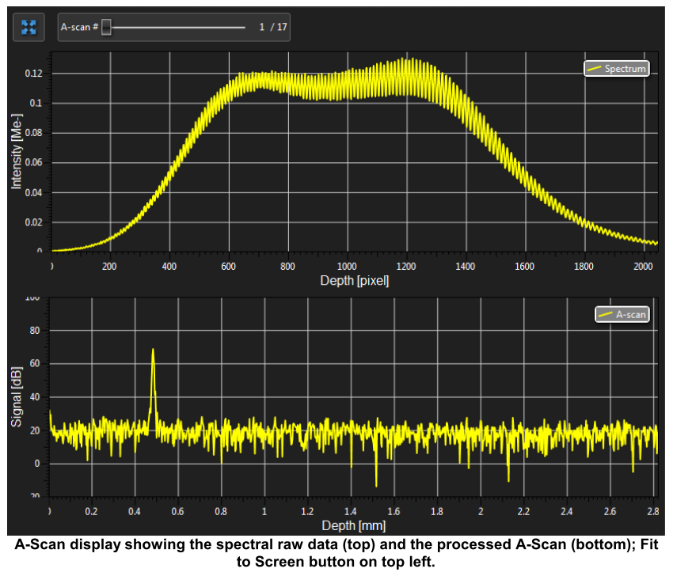

# A scan OCT

To get A-scan OCT using bench top setup and Thorlabs SDK and to visualize both spectral raw data (Intensity vs Depth)  and processed A scan data(Signal vs Depth).

##  Steps 

1. [How to Setup C++ on Windows](https://www.youtube.com/watch?v=1OsGXuNA5cc) 
2. [BEST Visual Studio Setup for C++ Projects!](https://www.youtube.com/watch?v=qeH9Xv_90KM)
3. [static linking](https://www.youtube.com/watch?v=or1dAmUO8k0) of [ThorLabs API](https://gitlab.advr.iit.it/BRL/laser/thorlabs-api) (We are using static linking because it is faster.)
4. Build it for x64. 