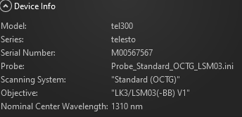

# A scan OCT

To get A-scan OCT using bench top setup and Thorlabs SDK and to visualize both spectral raw data (Intensity vs Depth)  and processed A scan data(Signal vs Depth).

##  Steps 

1. [How to Setup C++ on Windows](https://www.youtube.com/watch?v=1OsGXuNA5cc) 
2. [BEST Visual Studio Setup for C++ Projects!](https://www.youtube.com/watch?v=qeH9Xv_90KM)
3. [static linking](https://www.youtube.com/watch?v=or1dAmUO8k0) of [ThorLabs API](https://gitlab.advr.iit.it/BRL/laser/thorlabs-api) (We are using static linking because it is faster.)
4. Build it for x64. 

## To Do:

1. Get A, B scan images using the SDK and the std. objective lens to learn the SDK. The std. desktop configration we are using is:

2. Then, develop the configuration file(.ini) for the benchtop setup describing the objective lenses as well as correction factors for the draw and scan feature.
3. Acqurie the A-scan OCT and scan by moving the sample target and compare the data acquired with std. objective lens. 

The above three steps proves:
* The ability to use SDK
* The reference arm is correctly setup. 
4. How to interface our [custom endoscopic electromangtic scanner](https://ieeexplore.ieee.org/abstract/document/8629990) with thorlabs imagaing system?. 